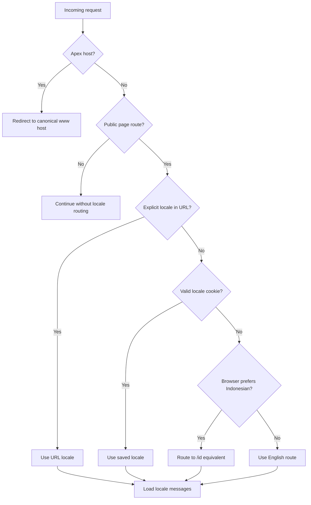

# Bahasa Indonesia website localization

Status: Proposed
Date: 29 July 2026
Scope: Makan marketing website
Default language: English (`en`)
Additional language: Bahasa Indonesia (`id`)

## 1. Summary

Makan will offer a complete Bahasa Indonesia version of its marketing website.
English will remain on the existing unprefixed URLs. Indonesian pages will use
the `/id` prefix:

| English | Bahasa Indonesia |
| --- | --- |
| `/` | `/id` |
| `/story` | `/id/story` |
| `/support` | `/id/support` |

The visitor's browser language may choose the initial version when no explicit
preference exists. An explicit language URL or a saved user choice always takes
priority.

The implementation will use locale-specific routes and reviewed translation
files. It will not translate copy in the browser or call a live translation
service.

## 2. Goals

1. Give Indonesian-speaking visitors a complete, natural Bahasa Indonesia
   experience.
2. Preserve all existing English URLs, inbound links and canonical URLs.
3. Let browser language provide a useful first-visit default without trapping
   visitors in that language.
4. Give English and Indonesian pages independent, indexable URLs and metadata.
5. Preserve Makan's warm, casual voice in both languages.
6. Keep product names and descriptions accurate to the currently English app UI.
7. Make adding another language later a content task rather than another routing
   refactor.

## 3. Non-goals

- Translating user-written meal captions, usernames, restaurant names or place
  names.
- Translating the iOS app.
- Runtime machine translation.
- Selecting a language from IP address or physical location.
- Publishing Indonesian blog, review or legal pages before their full content
  has been reviewed.
- Translating the brand name `Makan` or the product name `Eat or Yeet`.

## 4. Product decisions

### 4.1 URL strategy

Use locale prefixes only for non-default languages:

- English: unprefixed, such as `/story`
- Bahasa Indonesia: prefixed, such as `/id/story`

This `as-needed` prefix strategy avoids moving the current English site while
giving every Indonesian page a stable, shareable URL.

Do not serve two languages from the same canonical URL.

### 4.2 Language resolution order

Resolve language in this order:

1. An explicit locale in the URL.
2. A valid saved language cookie.
3. The browser's `Accept-Language` header.
4. English.

Examples:

| Request | Saved choice | Browser preference | Result |
| --- | --- | --- | --- |
| `/id/story` | English | English | `/id/story` |
| `/story` | Bahasa Indonesia | English | `/id/story` |
| `/story` | none | `id-ID, id, en` | `/id/story` |
| `/story` | none | `en-GB, en` | `/story` |
| `/story` | none | unsupported or missing | `/story` |

The browser language is a first-visit hint. It must never override an explicit
URL or a language the visitor selected themselves.

### 4.3 Automatic detection rollout

Automatic browser-language routing will not be enabled on the first preview.

Rollout order:

1. Publish `/id` routes in preview with automatic detection disabled.
2. Review every Indonesian page manually.
3. Enable the language switcher.
4. Add localized metadata and search annotations.
5. Enable automatic detection for visitors with no saved preference.

This separates translation QA from routing risk and gives the team a one-line
rollback: disable locale detection while leaving `/id` available.

### 4.4 Language switcher

Provide a visible language control in:

- the desktop navigation, near the primary app CTA;
- the mobile navigation menu;
- the footer.

Use text labels, not flags:

- `English`
- `Bahasa Indonesia`

The compact closed state may show `EN` or `ID`, but the expanded choices and
accessible name must use the full language names.

Behaviour:

- Switching language keeps the equivalent path when that translation exists.
- Query parameters and hash fragments are preserved.
- The selected language is saved for one year.
- The control exposes its current language to assistive technology.
- If the current page has no translation, the switcher links to the selected
  language's homepage and explains that the page is not yet available.

Suggested accessible names:

- `Language: English`
- `Language: Bahasa Indonesia`

## 5. Translation scope

### 5.1 Preview scope

Translate:

- navigation;
- homepage;
- homepage metadata;
- footer;
- FAQ and FAQ structured data;
- language preference UI;
- shared metadata and organization schema.

This is enough for copy and responsive review at `/id`, but not enough to enable
automatic detection across the site.

### 5.2 Automatic-detection launch scope

Translate before browser-language detection is enabled:

- App Store landing page;
- Story;
- Manifesto;
- restaurant partner page;
- contact page;
- support page;
- global buttons, form labels, success states and error messages;
- press boilerplate;
- secondary Open Graph copy.

Story belongs in this launch set because it explains Devon's Indonesian
background and the meaning of `makan`.

### 5.3 English-only until separately reviewed

Do not publish Indonesian versions until the complete page is reviewed:

- privacy policy;
- terms of service;
- blog index;
- individual reviews;
- dynamic restaurant pages containing editorial content.

For dynamic meal pages, translate the website shell only. Meal captions,
restaurant names and user content remain exactly as written.

Do not create an Indonesian URL whose navigation is Indonesian but whose main
article is English.

Maintain an explicit route-availability map. Browser detection only selects
Indonesian for a path after that path has an approved Indonesian version.
English-only paths remain English even when the browser prefers Indonesian.

## 6. Bahasa Indonesia voice

The Indonesian copy should sound like Makan, not like translated corporate
software.

### Voice

- Use `kamu`, not `Anda`.
- Prefer everyday Indonesian over formal institutional phrasing.
- Keep sentences short enough to read naturally on a phone.
- Preserve the humour when it still sounds natural; rewrite it when a literal
  translation would feel forced.
- Food should feel social and remembered, not measured or optimized.

### Product glossary

These terms remain unchanged because they are brand names or labels in the
current app:

| Source term | Indonesian treatment | Reason |
| --- | --- | --- |
| Makan | `Makan` | Brand |
| Eat or Yeet | `Eat or Yeet` | Named feature |
| Top 4 | `Top 4` | Named product surface |
| Public | `Public` with Indonesian explanation | Current app label |
| Friends Only | `Friends Only` with Indonesian explanation | Current app label |
| App Store | `App Store` | Platform name |

The glossary must be approved before translating page copy. If the app later
ships Indonesian UI, the website glossary should be updated to match it.

### Translation review

Every Indonesian message needs:

1. a first translation;
2. a read-aloud edit for natural rhythm;
3. review by a fluent Indonesian speaker familiar with Makan;
4. visual review at mobile, tablet and desktop widths.

Machine translation may be used for an internal first draft, but no
machine-generated copy ships without human review.

## 7. Technical architecture

### 7.1 Library

Add `next-intl`.

Reasons:

- supports Next.js App Router and Server Components;
- handles locale-prefixed routing and browser locale matching;
- remembers explicit choices in a locale cookie;
- provides locale-aware `Link`, redirect and router helpers;
- supports localized metadata and alternate links;
- supports ICU messages for counts, dates and plurals;
- avoids a custom internationalization framework that the project would need to
  maintain.

### 7.2 Proposed files

```text
app/
  [locale]/
    layout.tsx
    page.tsx
    app/page.tsx
    contact/page.tsx
    manifesto/page.tsx
    partner/page.tsx
    story/page.tsx
    support/page.tsx
    meal/[id]/page.tsx
    r/[place]/page.tsx
  api/
  robots.ts
  sitemap.ts

i18n/
  routing.ts
  request.ts
  navigation.ts
  availability.ts

messages/
  en.json
  id.json

proxy.ts
next.config.ts
```

Blog and legal routes may move under `[locale]` for architectural consistency,
but they must reject `id` until their complete content is approved.

`availability.ts` is the source of truth for which routes support Indonesian.
The proxy, language switcher, sitemap and metadata helpers must all consume the
same availability data.

### 7.3 Routing configuration

Conceptual configuration:

```ts
defineRouting({
  locales: ['en', 'id'],
  defaultLocale: 'en',
  localePrefix: 'as-needed',
  localeDetection: true
})
```

During preview and translation QA, set `localeDetection` to `false`.

For English-only routes, locale negotiation must be limited to `en`. This lets
the proxy perform the internal English rewrite needed by `as-needed` routing
without redirecting an Indonesian browser to an untranslated `/id` page.

Use the standard locale cookie name unless the implementation uncovers a
conflict. Configure it as a functional preference cookie with `SameSite=Lax`, a
site-wide path and a one-year lifetime.

### 7.4 Existing proxy composition

The current `proxy.ts` permanently redirects the apex domain to
`www.makanofficial.com`. Keep that behaviour.

Request processing:



Exclude these from locale negotiation:

- `/api`;
- `/_next`;
- `/_vercel`;
- images, fonts and other files containing an extension;
- `robots.txt`;
- `sitemap.xml`;
- app deep-link and verification files that require fixed paths.

Test the apex-host redirect and locale redirect together. Two correct redirects
are acceptable in the first implementation, but there must be no loop. They can
be collapsed into one redirect later if needed.

### 7.5 Locale layout

The locale layout must:

- validate the locale and return `notFound()` for unsupported values;
- generate static parameters for `en` and `id`;
- set `<html lang="en">` or `<html lang="id">`;
- load the matching messages;
- keep the current font, analytics, View Transitions, navigation and smooth
  scroll providers;
- preserve reduced-motion and accessibility behaviour.

The current root layout hardcodes `lang="en"` and will move into the locale
segment.

### 7.6 Messages

Start with two reviewed message files:

```text
messages/en.json
messages/id.json
```

Organize them by user-facing surface:

```json
{
  "Navigation": {},
  "Home": {
    "Hero": {},
    "MemoryThesis": {},
    "HowItWorks": {},
    "EatOrYeet": {},
    "ForYou": {},
    "AppShowcase": {},
    "WhyMakan": {},
    "FAQ": {},
    "FinalCTA": {}
  },
  "Footer": {},
  "Support": {},
  "Contact": {},
  "Metadata": {}
}
```

Use stable semantic keys such as `Home.Hero.heading`. Do not use English
sentences as keys.

English becomes the source-of-truth message file. Existing hardcoded strings
must first be extracted without changing their wording. Indonesian is added
only after English parity is verified.

### 7.7 Server and client components

- Server pages use `getTranslations`.
- Client components use `useTranslations`.
- Locale-aware links use wrappers from `i18n/navigation.ts`.
- Server redirects use the locale-aware redirect helper.
- Do not read `navigator.language` during render.
- Do not swap the DOM language in a client-side effect.

This prevents an English flash, hydration mismatches and non-indexable
translations.

### 7.8 Dates, numbers and live data

- Use `en-GB` formatting for English where the site currently expects British
  dates and number formatting.
- Use `id-ID` formatting for Indonesian.
- Preserve proper names and user content.
- Translate units and surrounding sentences, not values.
- Continue sharing the same Firestore meal data between language variants.

Adding a second statically rendered locale may create a second hourly homepage
render. Verify that meal-count and recent-meal data remain cached and that the
additional read volume is acceptable.

## 8. Search and sharing

Every translated page must have:

- a self-referential canonical URL;
- `hreflang="en"`;
- `hreflang="id"`;
- `hreflang="x-default"` pointing to the English/default version;
- a localized title and description;
- the correct Open Graph locale (`en_GB` or `id_ID`);
- localized social sharing copy;
- localized structured data where the visible content is localized.

The sitemap must list English and Indonesian URLs and connect available
translations as alternates.

Do not include an Indonesian alternate for a page that is still English-only.

Googlebot normally sends no `Accept-Language` header, so the unprefixed English
version must remain directly crawlable. Indonesian pages must be discoverable
through the sitemap and visible language links, not only through automatic
detection.

## 9. Analytics

Add the resolved locale to existing website analytics events.

Recommended events:

| Event | Properties |
| --- | --- |
| `language_switch_clicked` | `from_locale`, `to_locale`, `path` |
| `locale_landing_viewed` | `locale`, `path` |

Do not send the raw `Accept-Language` header. Store only the resolved supported
locale (`en` or `id`).

Success measures:

- percentage of visits using `/id`;
- Indonesian-to-English switchback rate;
- App Store CTA conversion by locale;
- support/contact completion by locale;
- localized-route 404 rate.

A high immediate switchback rate is a translation-quality signal.

## 10. Failure handling

| Failure | Required behaviour |
| --- | --- |
| Missing or malformed locale cookie | Ignore it and continue resolution |
| Unsupported browser language | Use English |
| Unsupported URL locale | Return 404; do not guess |
| Missing Indonesian message | Fail CI/build |
| Untranslated page requested under `/id` | Redirect to `/id` with an explanation and no Indonesian alternate metadata |
| Locale negotiation error | Serve English |
| Translation makes a component overflow | Block release until corrected |

Do not render message keys, partial dictionaries or mixed-language navigation in
production.

## 11. Testing

### 11.1 Unit tests

Test locale resolution for:

- `id`;
- `id-ID`;
- weighted values such as `id-ID,id;q=0.9,en;q=0.8`;
- English variants;
- unsupported languages;
- missing headers;
- cookie override;
- explicit URL override;
- invalid cookies.

Test that `en.json` and `id.json` contain identical message keys.

### 11.2 Proxy tests

Verify:

- apex host still becomes `www`;
- locale paths do not loop;
- API and static assets are never localized;
- query strings survive redirects;
- locale cookies override browser headers;
- explicit `/id` paths never become English;
- English remains unprefixed.

### 11.3 Page tests

For every translated route:

- English copy renders at the English URL;
- Indonesian copy renders at the `/id` URL;
- the HTML `lang` value is correct;
- the language switcher preserves the equivalent path;
- canonical and alternate links are correct;
- Open Graph and structured data use the page language;
- no missing-message warnings appear.

### 11.4 Responsive and visual tests

Test at minimum:

- 375 × 667;
- 390 × 844;
- 768 × 1024;
- 1024 × 768;
- 1440 × 900.

Indonesian strings may be longer than their English equivalents. Check:

- navigation wrapping;
- CTA width;
- FAQ headings;
- animation copy panels;
- sticky-section height;
- cards and phone mockups;
- form labels and errors;
- footer columns.

The accompanying copy for every animated section must remain readable in the
same viewport as the animation on mobile and tablet.

### 11.5 Accessibility

- Test the switcher by keyboard.
- Expose the selected language programmatically.
- Use full language names in accessible labels.
- Do not communicate language through flags or colour alone.
- Confirm focus survives locale navigation.
- Confirm screen readers announce the new document language.

## 12. Rollout plan

### Phase 0: Inventory and glossary

- Freeze the English homepage copy for extraction.
- Inventory every hardcoded string.
- Approve the product glossary.
- Confirm the preview and automatic-detection launch page sets.
- Assign an Indonesian reviewer.

Exit condition: approved glossary and complete launch-set string inventory.

### Phase 1: Locale architecture with English parity

- Add `next-intl`.
- Add routing, request and navigation configuration.
- Move public routes under `[locale]`.
- Extract current English copy into `en.json`.
- Compose locale routing with the existing canonical-host proxy.
- Keep locale detection disabled.

Exit condition: all current English URLs look and behave exactly as they do
before the refactor.

### Phase 2: Indonesian homepage and shared shell

- Create `id.json`.
- Translate navigation, homepage, footer and FAQ.
- Add `/id` routes.
- Add the language switcher.
- Add localized validation and error copy.

Exit condition: a reviewer approves `/id` at all target viewports.

### Phase 3: Detection-launch page set

- Translate App landing, Story, Manifesto, Partner, Contact and Support.
- Review form, validation, success and error copy in both languages.
- Add each page to the route-availability map only after approval.
- Keep Blog, legal and dynamic editorial routes English-only.

Exit condition: every route eligible for automatic detection has complete,
approved Indonesian content.

### Phase 4: Metadata and discovery

- Localize metadata and schema.
- Add canonicals, `hreflang` and sitemap alternates.
- Verify social cards.
- Add analytics locale properties.

Exit condition: automated SEO checks pass for every translated route.

### Phase 5: Controlled launch

- Deploy `/id` with automatic detection still disabled.
- Run production smoke tests.
- Enable browser-language detection.
- Monitor redirects, 404s, switching and CTA conversion.

Exit condition: no redirect loops, no elevated 404 rate and no material
English-parity regression.

### Phase 6: Editorial, legal and dynamic pages

- Translate Blog, reviews, legal copy and dynamic page shells in approved batches.
- Add language alternates only after each page passes review.
- Keep user-authored content in its original language.

## 13. Acceptance criteria

The feature is complete when:

1. Existing English URLs and copy remain unchanged unless separately approved.
2. `/id` and every route in the automatic-detection launch set serve complete,
   reviewed Indonesian copy.
3. An Indonesian browser with no saved preference reaches the Indonesian
   equivalent of an eligible unprefixed route after detection is enabled.
4. A manual language selection always overrides browser preference.
5. The selection persists across sessions.
6. Switching language preserves the equivalent path where it exists.
7. English and Indonesian pages have correct `lang`, canonical, `hreflang`,
   metadata and structured data.
8. Googlebot can crawl English without sending a language header and can
   discover Indonesian through links and the sitemap.
9. No untranslated or mixed-language route is published as Indonesian, and the
   route-availability map prevents browser detection from selecting one.
10. User content remains unchanged.
11. No translated string is clipped or hidden at the required viewports.
12. CI rejects missing translation keys.
13. The existing canonical-host redirect, analytics, ISR and App Store flow
    continue to work.

## 14. Approval required

One project decision remains before translation begins:

- Name the fluent Indonesian reviewer who gives final copy approval.

The recommended product decisions are otherwise fixed in this specification:

- automatic detection waits for the complete launch page set;
- Story is part of that set;
- current English app labels remain visible with Indonesian explanations;
- the compact switcher uses `EN / ID`, while its menu and accessible labels use
  `English / Bahasa Indonesia`.

## 15. References

- [Next.js internationalization guide](https://nextjs.org/docs/app/guides/internationalization)
- [Next.js Proxy guide](https://nextjs.org/docs/app/getting-started/proxy)
- [next-intl routing setup](https://next-intl.dev/docs/routing/setup)
- [next-intl locale detection](https://next-intl.dev/docs/routing/middleware)
- [MDN Accept-Language reference](https://developer.mozilla.org/en-US/docs/Web/HTTP/Reference/Headers/Accept-Language)
- [Google multilingual-site guidance](https://developers.google.com/search/docs/specialty/international/managing-multi-regional-sites)
